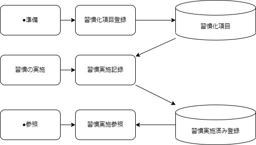

## ワークフロー
### ■ワークフロー図

### ■ワークフロー一覧
- 習慣化項目登録
  - 習慣にしたいと思ったころとを登録
  - 種別を管理する画面（種別生成機能）をもつ
  - 習慣化項目設定画面では、補足情報も追記できる。
- 習慣実施記録
  - 実際に実施したことを登録する。
  - 補足情報もとに、必要な項目は入力可能とする。
- 習慣実施参照
  - どの程度習慣化できているか確認する画面
  - 全体、種別単位、項目単位で参照可能
  - 基間は過去１月ぐらいを想定
  - 

