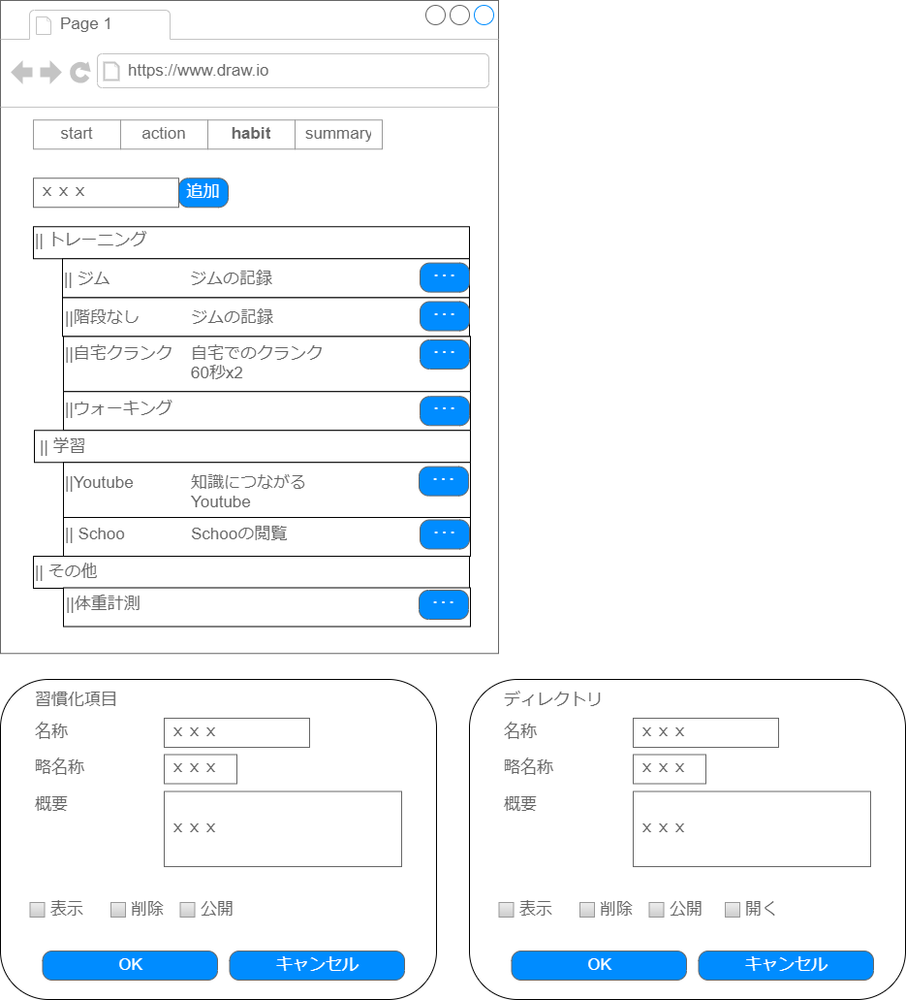
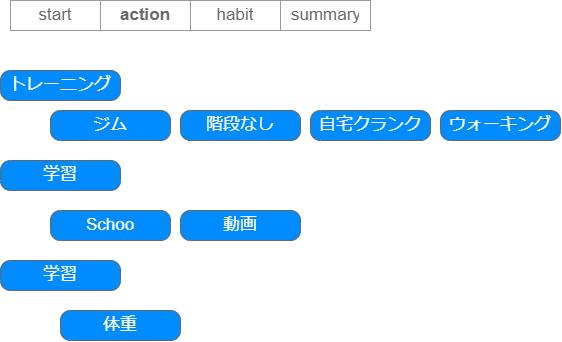
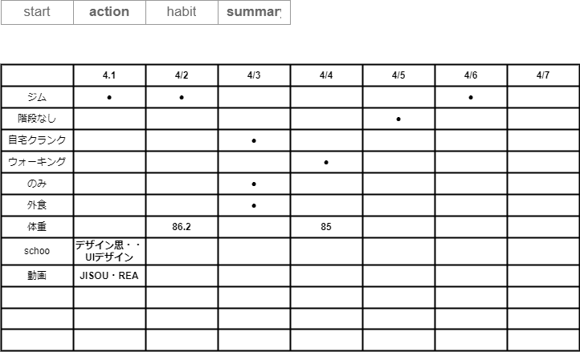

## 1.概要（Summary）
このプロジェクトは「習慣化を支援するアプリケーション」です。  
ユーザーは日々の習慣を登録・記録し、カレンダー上で習慣化の様子を可視化することができます。

## 2.セットアップ手順（Getting Started）

```bash
# リポジトリをクローン
git clone https://github.com/sickboy0001/hadbit-app.git
cd hadbit-app

# 依存関係をインストール
npm install

# 開発サーバーを起動
npm run dev
```

## 3. 使用技術一覧（技術スタックの要約）
「開発環境」のテーブルでも言及されていますが、**ひと目でわかるスタック表**があると見やすいです。

###  使用技術（Tech Stack）
- フロントエンド: React, Next.js, TypeScript
- UI: Tailwind CSS, shadcn/ui
- データベース: Supabase
- デプロイ: Vercel
- その他: 
- ▽react-google-charts, dnd-tree

#### ▽チャート、タイムラインについて
タイムラインチャート、ガントチャートは必要の認識  
利用有用なツールは以下かなと考えています  
「react-google-chart」が一番無難かも・・・

- 比較
  - https://zenn.dev/2timesbottle/articles/4ca75466772711
- Customizable React Gantt Chart
  - https://svar.dev/react/gantt/
- gantt chart react-google-chart
  - https://www.react-google-charts.com/examples/gantt
  - 軽量な静的タイムライン表示
- react-calendar-timeline
  - https://github.com/namespace-ee/react-calendar-timeline
  - 配色は調整できそう


## 4.デモ or スクリーンショット

Vercel；ｘｘｘｘ  
https://

## 5.環境
### ■開発環境

|No.|項目|ソフトウェア名、バージョン等			|
|-|-|-|
|1|OS|Edition:Window 10 Pro / バージョン:1607 以降 / 32-bit or 64-bit			|
|2|開発言語|TypeScript			|
|3|フレームワーク|React+NextJS|
|4|ソース管理|GitHub|
|5|開発ツール|VSCode|

### ■ハードウェア構成
|No.|項目|配置場所|構成|役割など|
|-|-|-|-|-|
|1|開発環境（ローカル）|ローカル||コードの実装|
|2|GItHub|インターネット||ソースの保存場所、vercel連携でも利用|
|3|Vercel|インターネット||デプロイ先|
|4|Supabase|インターネット||データベース|

## 6.設計
### ■システム配置
```
sickboy0001/hadbit-app https://github.com/sickboy0001/hadbit-app
├ public
├ src                →ソース
│ ├ app              →アプリ用ソース
│ │ ├ start          →ページ用ディレクトリ
│ │ │ └ page.tsx     →ページ本体
│ │ ├ test/tree      →ページ用ディレクトリ
│ │ │ └ page.tsx     →ページ本体
│ │ ├ favicon.ico
│ │ ├ globals.css
│ │ ├ layout.tsx    →レイアウト
│ │ └ page.tsx      →ページ本体
│ ├ components      →実装
│ │ ├ HabitItem/Management  →機能単位での実装・習慣化項目メンテナンス
│ │ │ ├ ManagementTree.tsx           →機能の実装部分
│ │ │ └ PageHabitItemManagement.tsx　→Pagexxxxは、各ページから呼ばれるもの
│ │ ├ dnd-tree
│ │ ├ test/tree       　→テスト用の機能
│ │ ├ ui                →shadcnui用
│ │ └ Header.tsx        →layoutで使う情報
│ └ lib
│    └ utils.ts
├ .gitignore
├ README.md
├ components.json
├ eslint.config.mjs
├ next.config.ts
├ package-lock.json
├ package.json
├ postcss.config.mjs
└ tsconfig.json
※sample)├│─└
```

### ■機能要件・一覧
|システム名|機能名|機能小項目|機能概要|
|-|-|-|-|
|習慣化メンテナンス|HabitMaintenance|-|新規で習慣化したい項目（以下習慣化マスタ）を登録できる。|
|習慣化メンテナンス|HabitMaintenance|-|習慣化マスタの表示順を親子関係含めて登録できる|
|習慣化メンテナンス|HabitMaintenance|-|習慣化マスタのゲストへの表示、非表示を制御できる|
|習慣化メンテナンス|HabitMaintenance|-|実施登録時への展開時のOpenCloseを登録できる。|
|習慣化登録|HabitDone|登録|ログイン者が自分の実施した習慣を登録できる|
|習慣化参照|HabitView|参照|ログイン者が自分の習慣化の状況を確認できる。|
|習慣化参照（ゲスト）|HabitView|ゲスト参照|ログイン者以外でも習慣化の状況確認できる|


### ■画面設計
- tailwindcss、shadcnuiを利用すること。
- AtomicDesingを意識した構成にすること。

メンテナンス画面


実施画面


参照画面



## 7.経緯
- 2025/06末、リリース目標

## 8.既知の課題
- [ ] 問題についての記載