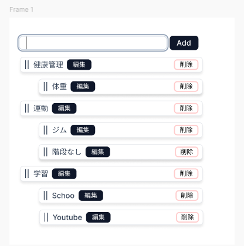
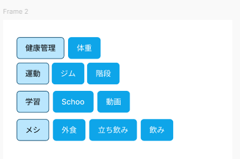
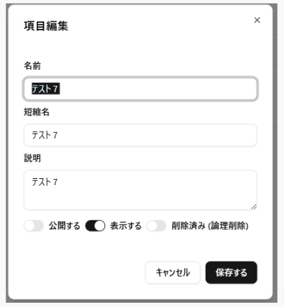

# プロジェクト定義書(ProjectSpecification)
## ■要求の背景・目的
### ◆システム開発の目的
- 「習慣をつける」はなかなか実践したくてもできないもの
- それを支援するためのツール
- [hadbit](https://hadbit-app.vercel.app/)
### ◆前提条件・制約条件・対象範囲
#### ▼前提条件
- Notionは試した見たけど、幾つか不満ある状態
  - 履歴、カレンダー表示をシンプルに、目的への進捗見れるようにしたい。
  - 公開、非公開の調整が難しい
#### ▼制約条件
- 2025年6月末
  - 個人での利用想定して公開。
  - ログイン機能は既存の機能を使う予定

#### ▼プロジェクトスコープ
- 習慣化するべきものをリストアップ
- そこから、ワンクリックで、その日に実施したと登録できる。
- 登録されたものは事後で調整可能
- 登録されたものは、カレンダー画面でいつ実行したか、どの程度の頻度で実施しているかなどわかること
### ◆用語定義
|用語|定義・説明|
|-|-|
|習慣化項目|習慣化を登録する行為名（ジム、クランク、のみ、外食など）|	
|習慣実施記録|習慣を日ごとに登録する行為|	
|カレンダー|各習慣がどの程度実施されているかを確認する画面|	

#### ▼アプリの機能
|日本語名|Exe名|説明|
|-|-|-|
|スタート画面|start|このアプリの目的などの提示、各画面への遷移ボタン|
|習慣登録画面|haditdone|各習慣を登録する画面。まじかの登録日時も各々表示|
|カレンダー画面|haditcalender|過去１カ月で実施したものを確認する画面|
|習慣メンテ画面|haditMnt|習慣のマスタのメンテナンス。開示、非開示、分類を登録する。|

#### ▼
1. 習慣メンテで習慣にしたいものを登録する。
2. 日々、習慣登録画面の表示、そこで習慣、実施したものを登録
3. 結果をカレンダー画面で確認


### ◆テーブルデザイン

[別資料](_041_er/readme.md)

todo
- 公開の有無
- 削除の有無
- ディレクトリ、項目の構成がある状態
- ディレクトリには公開の有無、削除の有無をもつ
- 項目にも同様にもつ

## ■業務要件の定義


### ◆業務フロー・ユースケース

[別紙](./_011_workflow/readme.md)参照


## ■機能要件の定義

### ◆機能開発全体方針

|項番|内容		|
|-|-|
|1|開発言語はReact+NextJS		|
|2|ソース管理は GitHub(xxxxxxxx) で行う		|

### ◆システム構成
#### システム配置
```
sickboy0001/hadbit-app https://github.com/sickboy0001/hadbit-app
├ public
├ src                →ソース
│ ├ app              →アプリ用ソース
│ │ ├ start          →ページ用ディレクトリ
│ │ │ └ page.tsx     →ページ本体
│ │ ├ test/tree      →ページ用ディレクトリ
│ │ │ └ page.tsx     →ページ本体
│ │ ├ favicon.ico
│ │ ├ globals.css
│ │ ├ layout.tsx    →レイアウト
│ │ └ page.tsx      →ページ本体
│ ├ components      →実装
│ │ ├ HabitItem/Management  →機能単位での実装・習慣化項目メンテナンス
│ │ │ ├ ManagementTree.tsx           →機能の実装部分
│ │ │ └ PageHabitItemManagement.tsx　→Pagexxxxは、各ページから呼ばれるもの
│ │ ├ dnd-tree
│ │ ├ test/tree       　→テスト用の機能
│ │ ├ ui                →shadcnui用
│ │ └ Header.tsx        →layoutで使う情報
│ └ lib
│    └ utils.ts
├ .gitignore
├ README.md
├ components.json
├ eslint.config.mjs
├ next.config.ts
├ package-lock.json
├ package.json
├ postcss.config.mjs
└ tsconfig.json
※sample)├│─└
```

#### ▼開発環境

|No.|項目|ソフトウェア名、バージョン等			|
|-|-|-|
|1|OS|Edition:Window 10 Pro / バージョン:1607 以降 / 32-bit or 64-bit			|
|2|開発言語|TypeScript			|
|3|フレームワーク|React+NextJS|
|4|ソース管理|GitHub|
|5|開発ツール|VSCode|


#### ▼ハードウェア構成
|No.|項目|配置場所|構成|役割など|
|-|-|-|-|-|
|1|開発環境（ローカル）|ローカル||コードの実装|
|2|GItHub|インターネット||ソースの保存場所、vercel連携でも利用|
|3|Vercel|インターネット||デプロイ先|
|4|Supabase|インターネット||データベース|

#### ▼機能要件・一覧（リンク）
|システム名|機能名|機能小項目|機能概要|
|-|-|-|-|
|習慣化メンテナンス|HabitMaintenance|-|新規で習慣化したい項目（以下習慣化マスタ）を登録できる。|
|習慣化メンテナンス|HabitMaintenance|-|習慣化マスタの表示順を親子関係含めて登録できる|
|習慣化メンテナンス|HabitMaintenance|-|習慣化マスタのゲストへの表示、非表示を制御できる|
|習慣化メンテナンス|HabitMaintenance|-|実施登録時への展開時のOpenCloseを登録できる。|
|習慣化登録|HabitDone|登録|ログイン者が自分の実施した習慣を登録できる|
|習慣化参照|HabitView|参照|ログイン者が自分の習慣化の状況を確認できる。|
|習慣化参照（ゲスト）|HabitView|ゲスト参照|ログイン者以外でも習慣化の状況確認できる|


#### ▼画面に関する条件
- tailwindcss、shadcnuiを利用すること。
- AtomicDesingを意識した構成にすること。

##### ▽チャートについて
タイムラインチャート、ガントチャートは必要の認識  
利用有用なツールは以下かなと考えています  
「react-google-chart」が一番無難かも・・・

- 比較
  - https://zenn.dev/2timesbottle/articles/4ca75466772711
- Customizable React Gantt Chart
  - https://svar.dev/react/gantt/
- gantt chart react-google-chart
  - https://www.react-google-charts.com/examples/gantt


##### 画面一覧

習慣化一覧画面

習慣化メンテナンス画面


記録画面



[原本](https://www.figma.com/design/j6MqagLNYSju7cH2SVUpvK/Zettelkasten_tool_-shadcn-ui?node-id=2102-1046&p=f&t=6oHssI3mLvlLrBt0-0)


例）
|機能ID|機能名|画面ID|画面名|画面概要|備考|
|-|-|-|-|-|-|
|


##### 画面遷移図（リンク）
***
例）
***

##### 画面レイアウト
***
例）


***
#### ▼帳票・出力ファイルに関する要件
***
例）
- 生成AIとの連携用ファイルについては常駐端末のローカルフォルダ内に配置すること（個人情報を含む可能性があるため共有フォルダはNG）
- プロンプトマスタでインポート/エクスポートするプロンプトファイルについては印刷されたときに見やすいこと
- プロンプトマスタでインポート/エクスポートするプロンプトファイルについては他病院への入れ込みが出来ること
***


##### 関連するデータ・テーブル・エンティティ
***
例）
|データID|データ名（マスタ名など）|データ詳細（構造、項目名など）||
|-|-|-|-|
|**

## ■非機能要件に関する事項
### ◆性能に関する事項
***
例）
システム名				項目								性能目標				備考																	

***

### ◆ユーザビリティに関する事項
***
例）
|分類|要求|対応|
|-|-|-|
|画面構成|N2.2デザイン規約に準拠させること|N2.2デザイン規約に準拠させる|
|操作のしやすさ|シンプルで直感的であること|不要な機能や情報を減らしてシンプルな画面構成にする|
||システム全体を通して操作方法が統一されていること|コントロール毎の操作方法を統一させる|
|わかりやすさ|操作対象が何を行うものか、ユーザーが容易に理解できること|アイコンのみで理解が容易でない場合はテキストも配置する|
||処理に時間がかかる場合はその旨が伝わるようにすること|プログレスバーなどを活用する|
||ボタンを押したときのアクションが明確であること|必要に応じて処理の成功や失敗などを伝える|
|エラーの防止|データ削除など重要な処理については事前に注意表示を行い、利用者の確認を促すこと|削除前には必ず確認メッセージを表示する|
||エラーメッセージは具体的にし、解決策を提示すること|エラーメッセージは具体的にし、解決策を提示する|

***

### ◆セキュリティに関する事項
***
例）
|分類|要求|対応|
|-|-|-|
|機密性|許可された利用者のみ参照、登録、更新、削除が行えること|ユーザごとに権限を設定できるようにする||
|完全性|生成AIによる生成過程において患者情報の混合を防止する対策を講じること|最終的な生成AIへの生成リクエストは1患者ずつ実施する（＝並列処理しない）||
|可用性|アプリ停止が早期に検知できること|常駐監視対象病院ではskysea設定を行うこと||
|可用性|複数病院からの生成リクエストに耐えられること|AWS側でAロードバランサーを導入したり、病院毎にアカウントを切り分ける等の対策を実施する||
|真正性|利用者の認証が行えること|不要　※通常のエントランスログインを前提とするため||
|真正性|AWSとの通信中に、送受信されるデータが改ざんされないように対策を講じること|社内-AWS間はHTTPS通信とする||
|信頼性|データが破壊・削除されても復旧可能にすること|AI生成に利用するプロンプト（電子カルデータを含む）はテキストログとして一定期間は保管する||
|責任追跡性|ログを残すこと|テキストログおよびDBログを残す||
|否認防止|なし|不要||
|DBアクセスユーザー|特殊権限のユーザーを使用しないこと|user1は使用しない||

***
### ◆拡張性／互換性／中立性に関する事項
***
例）
|分類|要求|対応|
|-|-|-|
|拡張性|生成AIのモデル変更（例：Sonnet→Haiku）に容易に対応できること|将来のモデル拡張を考慮に入れた設計にする|
|拡張性|診療データの参照元データの増加に容易に対応できること|将来の参照元データの増加を考慮に入れた設計にする（例：OCP）|
|互換性|なし|不要|

***
### ◆メンテナンスしやすさに関する事項
***
例）
|分類|要求|対応|
|-|-|-|
|保守性|開発・保守・導入に関するドキュメントが整備されていること|製品版ローンチまでに開発・保守・導入に関するドキュメントを整備する|
|保守性|修正がしやすいようなソースコードになっていること|可能な限りソースコードをきれいな状態にした上で保守フェーズに移行する（そのための作業工数を確保する）|


***
### ◆品質に関する事項
***
例）
分類	要求	対応	
単体テスト	内部設計および単体テスト計画書に基づき各モジュールの単体テストを行うこと	内部設計書を作成し、設計書に基づいたホワイトボックステストを行う	
結合テスト	外部設計および結合テスト計画書に基づきテスト仕様書を作成し、テスト仕様書にしたがって結合テストを行うこと	設計工程にてテスト仕様書を作成する	
	
	仕様通りに操作できるか、誤った操作をしても適切なエラーメッセージが表示されるか等の操作確認を行うこと	異常系テストの割合を2割以上含める	
	
	テスト対象に対して異常データを含む様々なバリエーションのデータを投入し、動作および処理結果を確認すること	異常系テストデータの割合を2割以上含める	
	
総合テスト	要件定義および総合テスト計画書に基づきテスト仕様書を作成し、テスト仕様書にしたがって総合テストを行うこと	設計工程にて総合テスト仕様書を作成する	
	
	システムで想定される全ての業務シナリオ及び運用シナリオを対象とし、総合テストを実施すること。	ユースケースに基づいた業務シナリオテストを実施する	
	
	性能や負荷に係るテストを行い、充分な性能を満たせることを確認すること。	総合テスト実施工程にで性能テストおよび負荷テストを実施する	

***
### ◆移行に関する事項
***
例）
移行に関する事項	※実証実験と製品化に向けた開発を同時並行で進めることになる為、実証実験の協力病院が最終的な製品版へ移行するときを想定して記載	
分類	要求	対応	
既存システムからのデータ移行	実証実験段階に作成されたシステムのデータは基本的には全て移行対象とすること	"（必要に応じてFSEと連携して）データコンバートを実施する
対象外データに関しては病院様へ理由を説明し、合意を得る"	
	
システム移行	"生成AI連携システムに関する業務停止時間は最大3日間とすること
通常診療業務で利用する業務アプリの移行を最優先とすること"	切り替えスケジュールを事前提示し、合意を得る	
	
業務運用移行	スムーズに生成AI連携を現行業務に含められること	操作説明書を作成して病院様へ提示する	
	
移行スケジュール	実証実験の協力病院がスムーズに製品版へ移行できること	製品版ローンチの2～3か月前を目安に移行を実施する	
	
他移行の要件	実証実験版と製品版との差でユーザーが混乱しないようにすること	事前に病院様へ操作説明を行う	
	
***
### ◆教育に関する事項
***
例）
分類	要求	対応	
操作マニュアル	病院様にて操作教育を行う際に必要となる教材やマニュアル等を作成すること	病院様向けの操作マニュアルを作成する	
操作マニュアル	SSIスタッフがシステムを導入する上で必要となる教材やマニュアル等を作成すること	SSIスタッフ向けの操作マニュアルを作成する	
運用マニュアル	なし	不要	
教育実施	なし	不要	

***
### ◆運用・保守・引継ぎに関する事項
***
例）
分類	要求	対応	
保守要件	稼働後の保守は、当社にて実施すること	※未定	
	イニシャルコスト：導入費用、回線費用	
	ランニングコスト：AWS利用料（定額？）	
	保守業務を実施する際に必要となる、開発ドキュメントや保守手順等を作成すること	製品版ローンチまでに開発・保守・導入に関するドキュメントを整備する	
	ネットワーク周りの保守はインフラソリューション部に担当してもらうこと	各種ドキュメントを整備する、インフラソリューション部と調整する	
	AWSクラウド内の開発を先進技術研究室以外の部署に移管すること	各種ドキュメントを整備する、AWSに関する勉強会を実施してもらう	


****
# MarkDown記載方法（サンプル）

オリジナルデータはWikiサイトから入手して、
「C:\temp\pages」に保存


### ■テーブル
 table name : **wiki_infradata**
|key|name|type|descritpion|
|--|-|-|-|
|*|id|連番ID|一意キー|
||directory_name|nvarchar(max)| ディレクトリ名　|
||directory_name_decode|nvarchar(max)| ディレクトリ名　|
||file_name |nvarchar(max)| ファイル名 |
||file_name_decode |nvarchar(max)| ファイル名 |
||contents |nvarchar(max)| コンテンツ  |


### ■テーブル作成スクリプト
Create_wiki_inforadata.sql

```SQL
CREATE TABLE wiki_infradata (
    id INT IDENTITY(1,1) PRIMARY KEY, -- 連番ID (一意キー)
    directory_name NVARCHAR(MAX),     -- ディレクトリ名
    directory_name_decode NVARCHAR(MAX), -- ディレクトリ名（デコード）
    file_name NVARCHAR(MAX),          -- ファイル名
    file_name_decode NVARCHAR(MAX),   -- ファイル名（デコード）
    contents NVARCHAR(MAX)            -- コンテンツ
);
```


### ■環境
- c:\GID\CnvWikiToDb\  
  - log
    - yyyy-mm-dd.log
      - 日付単位でのログ、１月以上古いファイル自動で削除される。
  - xxx.exe
  - Setting.xml -> 不要
  - Dbconnetion.xml -> 不要
    - データベース接続情報
  - WIkiToDbSetting.xml -> 不要
  - Create_wiki_inforadata.sql

### ■Exeの呼び出し方
前提１）前提として、対象のデータベースに、「Create_wiki_inforadata」でテーブル作ること。  
前提２）また権限は必要に応じて、「databaseuser」に応じて削除、登録の権限を付与すること。

```bash
xxx.exe -wikipath:"pathxxx" -host:"serverxx" -databasename:"xxxxdb" -databaseuser:"userxxx" -databasepassword:"passxxx" -dataclear:true/false -CurrentPath:"C:\GAI\WikiToDb" -wikitodbtemp:"c:\gai_temp" -output:csv

help ヘルプ
wikipath:pathxxx: wikiのデータのパス　def  C:\temp\pages
host:serverxx：ホスト名 sqlserverの名前
databasename:xxxxdb:SQLServerでのデータベース名
databaseuser:userxxx: sqlserverへのログインユーザー sa　など
databasepassword: ユーザーに対応するパスワード
dataclear:true　一度データを削除する false データは削除されない。同一テーブルに追加
currentpath:xxxx 実行ファイルのあるパス　C:\GAI\WikiToDb 
wikitodbtemp:"c:\gai_temp":currentpathないにある「temp」フォルダの場合、パス名が長いのを回避するためのパス
output:csv csv出力の場合には記載、記載なしなら、データベースへの登録 出力先はExeと同じ場所
```

```ini
Newton.ini
[BynSamKy]
;移動情報引用画面で、転科は退院とみなすかどうか(0:みなす(DEF) 1:みなさない)
;※Hoozuki.ini[SinkiInyou]NotTenkaCheckと設定を統一してください。
NotTenkaCheck=1
;同じ診療科に転科のときはサマリーを(1:わける,0=わけない(=Def))
NotSammaryDivide = 1"
```

### ■コンバート用のコンソールの作成（CnvWikiToDB)
- 設定ファイルもで持つもの。→不要説
- DBへの接続の仕方、現状推奨で。→引数で調整
- DBへの接続設定Xml
- 処理：ファイルの読み取り
- 処理：DBへの書き込み
- 処理：進捗など残すようにする。→ログフォルダの中に作成する。

### 連番
1. test
1. test2

### ■参考
htmlurl エンコーディング、デコーディング
https://dobon.net/vb/dotnet/internet/urlencode.html#google_vignette


<details><summary>すごく長い文章とかプログラムとか</summary>

```python
print('Hello world!')
```
</details>


### Html出力時の注意
Htmlの中で
markdown,highlightの参照がるので、以下に置き換えが必要
また、該当Html保存している場所に、「markdown.css」「highlight.css」が必要

```html
<link rel="stylesheet" href="./markdown.css">
<link rel="stylesheet" href="./highlight.css">
```
